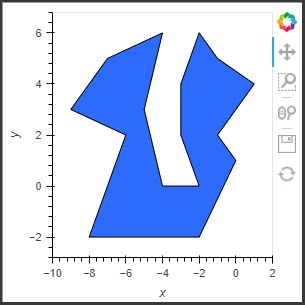

# Algorithms 2 - TP 01

### Polygons triangulation with Ear-clipping algorithm and vertices coloring (3-coloring)

-------------------------
- Input exemple:
INPUT = [(-6,2), (-8,-2), (-2,-2), (0,1), (-1,2), (1,4), (-1,5), (-2,6), (-3,4), (-3,2), (-2,0), (-4,0), (-5,3), (-4,6), (-7,5), (-9,3)]

